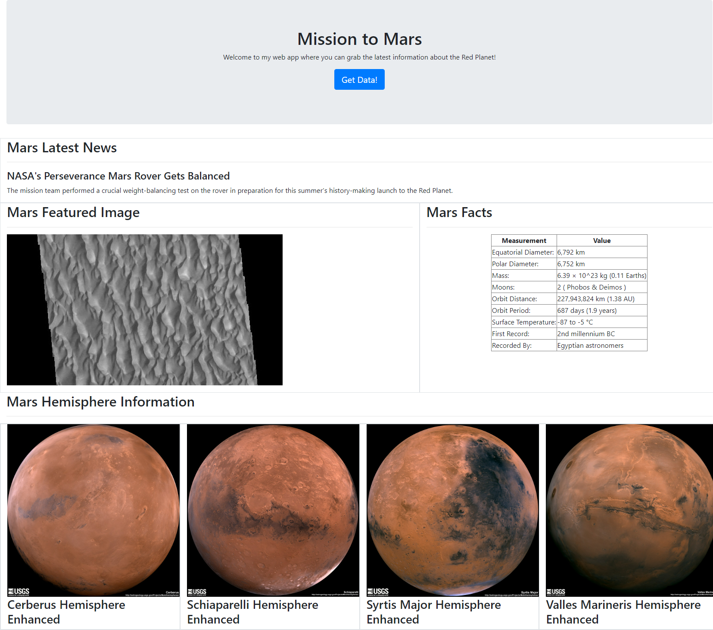

# Unit 12 Homework: Mission to Mars

In this assignment, I built a web application that scrapes various websites for data related to the Mission to Mars and displays the information in a single HTML page.

## Tasks Completed

The tasks for this assignment were divided into three parts: 

1. Scraping 

2. MongoDB and Flask Application

3. HTML development 

## Part  1: Scraping

* Initial scraping was completed using Jupyter Notebook with the BeautifulSoup, Pandas, and Splinter modules.

* The notebook can be found at [missions_to_mars.ipynb](missions_to_mars.ipynb)

### NASA Mars News

* I was instructed to scrape the [Mars News Site](https://redplanetscience.com/) and collect the latest News Title and Paragraph Text.

### JPL Mars Space Images—Featured Image

* I was instructed to visit the URL for the [Featured Space Image site](https://spaceimages-mars.com) and use Splinter to navigate the site and find the image URL for the current Featured Mars Image, then assign the full image URL to a variable.

### Mars Facts

* I was instructed to visit the [Mars Facts webpage](https://galaxyfacts-mars.com) and use Pandas to scrape the table containing facts about the planet including diameter, mass, etc.

* I then used Pandas to convert the data to a HTML table string.

### Mars Hemispheres

* I was instructed to visit the [astrogeology site](https://marshemispheres.com/) to obtain high-resolution images for each hemisphere of Mars.

* This required each of the links to the hemispheres to be selected in order to find the image URL to the full-resolution image. This was achieved using the Splinter module.

* I then used a Python dictionary to store the data using the keys `img_url` and `title`. I then appended each dictionary created to a master list.

## Part 2: MongoDB and Flask Application

I was instructed to use MongoDB with Flask templating to create a new HTML page that displays all the information that was scraped from the URLs above.

* I converted my Jupyter notebook into a Python script called [scrape_mars.py](scrape_mars.py) by defining a function called `scrape`. This function executed all of my scraping code from above and return one Python dictionary containing all the scraped data.

* Next, I created a Flask app called [mars_app.py](mars_app.py) and defined a route called `/scrape` that imported my `scrape_mars.py` script, called my `scrape` function and stored the return value in Mongo as a Python dictionary.

* I also created a root route `/` that will query my Mongo database and pass the Mars data into an HTML template for displaying the data.

## Part 3: HTML development

* I created a template HTML file called [index.html](templates/index.html) that will take the Mars data dictionary and display all the data in the appropriate HTML elements. Below is a picture of my final page for submission:

